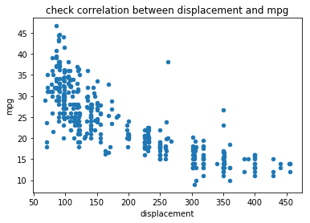
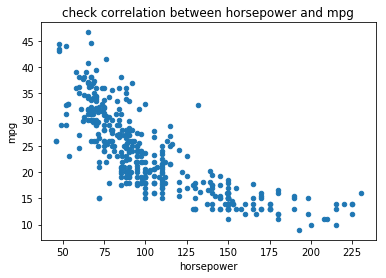
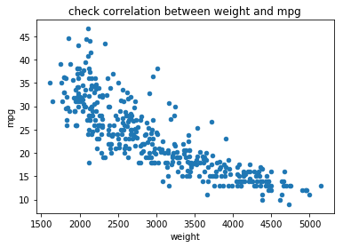

# Linear-Regression--Automobile-Miles-per-Gallon
Uses Python requests to obtain data from the Auto.mpg dataset hosted on https://archive.ics.uci.edu/ml/machine-learning-databases/auto-mpg/auto-mpg.data and understand the accuracy of a Linear Regression Model by obtaining the Root Mean Square Error. The Linear Regression Model attempts to predict vehicle mileage in miles per gallon(mpg) based on three predictors - engine displacement, horsepower and weight. We use a simple hold-out cross-validation method with 80% of the data as training data and 20% as test data.

From the training data, the relationship between vehicle mpg and the three predictors (displacement, horsepower and weight) is as follows:

After training the linear regression model, the root mean square error is measured to be about 7.7 mpg.

